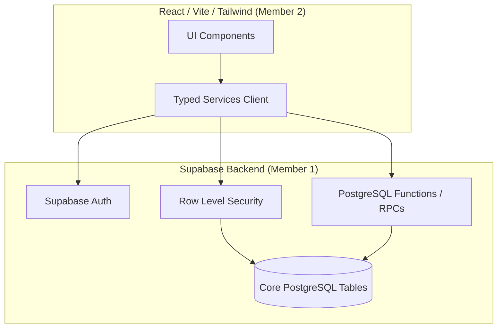
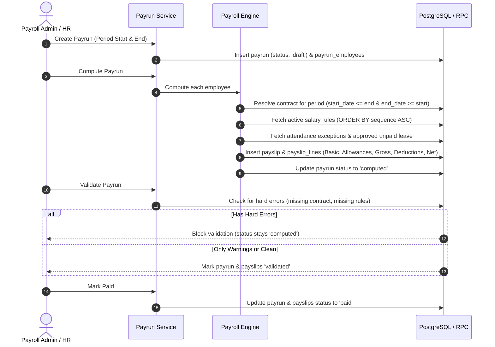

# PeoplePay360 — Backend Architecture

## Overview
**PeoplePay360** is an enterprise-grade Human Resources and Payroll system designed to connect:
```text
Employee → Contract → Working Schedule → Attendance → Time Off → Salary Structure → Salary Rules → Payrun → Payslip
```

The system is built on **Supabase PostgreSQL**, leveraging:
- PostgreSQL database engine with strict relational constraints and indexing.
- Supabase Auth for identity management.
- PostgreSQL Row Level Security (RLS) for data protection at the query level.
- Transactional Database Functions (RPCs) for atomic operations (payroll computation, leave approvals, validation).
- A strongly typed TypeScript service layer ready for consumption by Member 2's React/Vite frontend.

---

## High-Level Architecture Diagram



---

## Core Domain Modules

| Module | Purpose | Key Tables |
| :--- | :--- | :--- |
| **Auth & Profiles** | Identity, RBAC role assignment, user linking | `profiles`, `auth.users` |
| **Organization** | Department hierarchy, positions, management structure | `departments`, `employees` |
| **Contracts** | Historical wage agreements with effective date ranges | `contracts` |
| **Schedules** | Standard & flexible work schedules with break times | `working_schedules`, `working_schedule_days` |
| **Attendance** | Clock-in/out, worked hours calculation, anomaly detection | `attendance` |
| **Time Off** | Leave allocations, balance tracking, approval workflows | `time_off_types`, `time_off_allocations`, `time_off_requests` |
| **Salary Rules** | Sequential formula & percentage-based compensation modeling | `salary_structures`, `salary_rules` |
| **Payroll Engine** | Period-based contract resolution, leave adjustments, calculation | `payruns`, `payrun_employees`, `payslips`, `payslip_lines` |
| **Dashboard** | Real-time operational KPI aggregation | RPC: `get_dashboard_metrics` |

---

## Payroll Life-Cycle Workflow



---

## Technology Stack
- **Database**: PostgreSQL 15+ (Supabase)
- **Security**: PostgreSQL Row Level Security (RLS) with security definer functions
- **Engine Logic**: PostgreSQL PL/pgSQL RPCs & Isomorphic TypeScript calculation engine
- **Client Services**: `@supabase/supabase-js` v2 with strict TypeScript types
- **Testing**: Vitest & Node.js
