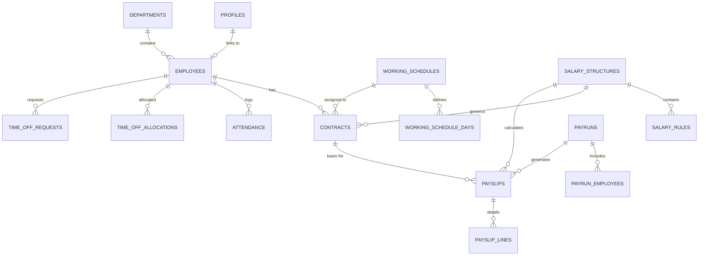

# PeoplePay360 — Database Schema Reference

## Overview
The PeoplePay360 schema is implemented with standard PostgreSQL types, UUID primary keys, explicit foreign keys with cascade/set-null policies, and constraints to guarantee transactional consistency.

---

## Entity Relationship Diagram

---

## Tables & Fields Specification

### 1. `profiles`
Links Supabase authenticated users (`auth.users`) to application roles and optionally an employee profile.
- `id` UUID PRIMARY KEY REFERENCES `auth.users(id)` ON DELETE CASCADE
- `email` TEXT NOT NULL UNIQUE
- `full_name` TEXT NOT NULL
- `role` TEXT NOT NULL CHECK (`role` IN ('employee', 'hr_manager', 'hr_payroll_user', 'hr_payroll_manager', 'admin'))
- `employee_id` UUID REFERENCES `employees(id)` ON DELETE SET NULL
- `is_active` BOOLEAN NOT NULL DEFAULT true
- `created_at` TIMESTAMPTZ NOT NULL DEFAULT NOW()
- `updated_at` TIMESTAMPTZ NOT NULL DEFAULT NOW()

### 2. `departments`
- `id` UUID PRIMARY KEY DEFAULT `gen_random_uuid()`
- `name` TEXT NOT NULL
- `code` TEXT NOT NULL UNIQUE
- `manager_id` UUID REFERENCES `employees(id)` ON DELETE SET NULL
- `is_active` BOOLEAN NOT NULL DEFAULT true
- `created_at` TIMESTAMPTZ NOT NULL DEFAULT NOW()
- `updated_at` TIMESTAMPTZ NOT NULL DEFAULT NOW()

### 3. `employees`
- `id` UUID PRIMARY KEY DEFAULT `gen_random_uuid()`
- `employee_code` TEXT NOT NULL UNIQUE
- `first_name` TEXT NOT NULL
- `last_name` TEXT NOT NULL
- `email` TEXT NOT NULL UNIQUE
- `phone` TEXT
- `date_of_birth` DATE
- `joining_date` DATE NOT NULL
- `department_id` UUID REFERENCES `departments(id)` ON DELETE RESTRICT
- `manager_id` UUID REFERENCES `employees(id)` ON DELETE SET NULL
- `job_position` TEXT NOT NULL
- `employee_type` TEXT NOT NULL DEFAULT 'full_time' CHECK (employee_type IN ('full_time', 'part_time', 'contractor', 'intern'))
- `status` TEXT NOT NULL DEFAULT 'active' CHECK (status IN ('active', 'inactive', 'terminated'))
- `bank_account_number` TEXT
- `bank_name` TEXT
- `bank_ifsc_or_routing` TEXT
- `created_at` TIMESTAMPTZ NOT NULL DEFAULT NOW()
- `updated_at` TIMESTAMPTZ NOT NULL DEFAULT NOW()

### 4. `working_schedules` & `working_schedule_days`
- **`working_schedules`**:
  - `id` UUID PRIMARY KEY DEFAULT `gen_random_uuid()`
  - `name` TEXT NOT NULL
  - `description` TEXT
  - `weekly_hours` NUMERIC(5,2) NOT NULL DEFAULT 40.00
  - `is_active` BOOLEAN NOT NULL DEFAULT true
- **`working_schedule_days`**:
  - `id` UUID PRIMARY KEY DEFAULT `gen_random_uuid()`
  - `schedule_id` UUID NOT NULL REFERENCES `working_schedules(id)` ON DELETE CASCADE
  - `day_of_week` INT NOT NULL CHECK (day_of_week BETWEEN 0 AND 6)
  - `is_working_day` BOOLEAN NOT NULL DEFAULT true
  - `start_time` TIME WITHOUT TIME ZONE DEFAULT '09:00:00'
  - `end_time` TIME WITHOUT TIME ZONE DEFAULT '18:00:00'
  - `break_minutes` INT NOT NULL DEFAULT 60
  - `CONSTRAINT uq_schedule_day UNIQUE (schedule_id, day_of_week)`

### 5. `contracts`
Supports historical compensation tracking.
- `id` UUID PRIMARY KEY DEFAULT `gen_random_uuid()`
- `employee_id` UUID NOT NULL REFERENCES `employees(id)` ON DELETE CASCADE
- `contract_number` TEXT NOT NULL UNIQUE
- `start_date` DATE NOT NULL
- `end_date` DATE (NULL means indefinite)
- `wage` NUMERIC(12,2) NOT NULL CHECK (wage >= 0)
- `department_id` UUID REFERENCES `departments(id)` ON DELETE SET NULL
- `job_position` TEXT NOT NULL
- `salary_structure_id` UUID NOT NULL REFERENCES `salary_structures(id)` ON DELETE RESTRICT
- `working_schedule_id` UUID REFERENCES `working_schedules(id)` ON DELETE SET NULL
- `status` TEXT NOT NULL DEFAULT 'active' CHECK (status IN ('draft', 'active', 'expired', 'terminated'))
- `CONSTRAINT chk_contract_dates CHECK (end_date IS NULL OR end_date >= start_date)`

### 6. `time_off_types`, `time_off_allocations`, `time_off_requests`
- **`time_off_types`**:
  - `id` UUID PRIMARY KEY DEFAULT `gen_random_uuid()`
  - `name` TEXT NOT NULL, `code` TEXT NOT NULL UNIQUE
  - `is_paid` BOOLEAN NOT NULL DEFAULT true, `default_allocation` NUMERIC(4,1)
- **`time_off_allocations`**:
  - `id` UUID PRIMARY KEY DEFAULT `gen_random_uuid()`
  - `employee_id` UUID NOT NULL REFERENCES `employees(id)` ON DELETE CASCADE
  - `time_off_type_id` UUID NOT NULL REFERENCES `time_off_types(id)` ON DELETE RESTRICT
  - `allocated_days` NUMERIC(5,2), `used_days` NUMERIC(5,2)
  - `remaining_days` NUMERIC(5,2) GENERATED ALWAYS AS (allocated_days - used_days) STORED
- **`time_off_requests`**:
  - `id` UUID PRIMARY KEY DEFAULT `gen_random_uuid()`
  - `employee_id` UUID NOT NULL REFERENCES `employees(id)` ON DELETE CASCADE
  - `time_off_type_id` UUID NOT NULL REFERENCES `time_off_types(id)` ON DELETE RESTRICT
  - `start_date` DATE NOT NULL, `end_date` DATE NOT NULL, `number_of_days` NUMERIC(4,1) NOT NULL
  - `status` TEXT NOT NULL DEFAULT 'pending' CHECK (status IN ('pending', 'approved', 'refused', 'cancelled'))

### 7. `attendance`
- `id` UUID PRIMARY KEY DEFAULT `gen_random_uuid()`
- `employee_id` UUID NOT NULL REFERENCES `employees(id)` ON DELETE CASCADE
- `attendance_date` DATE NOT NULL
- `check_in` TIMESTAMPTZ, `check_out` TIMESTAMPTZ
- `worked_hours` NUMERIC(5,2), `expected_hours` NUMERIC(5,2)
- `status` TEXT NOT NULL CHECK (status IN ('present', 'absent', 'late', 'half_day', 'overtime', 'leave'))
- `CONSTRAINT uq_employee_attendance_date UNIQUE (employee_id, attendance_date)`

### 8. `salary_structures` & `salary_rules`
- **`salary_structures`**: `id`, `name`, `code` (UNIQUE), `description`, `is_active`
- **`salary_rules`**:
  - `id` UUID PRIMARY KEY DEFAULT `gen_random_uuid()`
  - `salary_structure_id` UUID NOT NULL REFERENCES `salary_structures(id)` ON DELETE CASCADE
  - `name` TEXT NOT NULL, `code` TEXT NOT NULL
  - `sequence` INT NOT NULL DEFAULT 10
  - `category` TEXT NOT NULL CHECK (category IN ('basic', 'allowance', 'deduction', 'employer_contribution', 'other'))
  - `computation_type` TEXT NOT NULL CHECK (computation_type IN ('fixed', 'percentage', 'formula'))
  - `value` NUMERIC(12,2), `percentage` NUMERIC(5,2), `formula` TEXT
  - `is_taxable` BOOLEAN NOT NULL DEFAULT true
  - `CONSTRAINT uq_salary_rule_code_structure UNIQUE (salary_structure_id, code)`

### 9. `payruns` & `payrun_employees`
- **`payruns`**:
  - `id` UUID PRIMARY KEY, `name` TEXT, `period_start` DATE, `period_end` DATE, `payment_date` DATE
  - `status` TEXT CHECK (status IN ('draft', 'computed', 'validated', 'paid'))
  - `computed_at`, `validated_at`, `paid_at`
- **`payrun_employees`**:
  - `id` UUID PRIMARY KEY, `payrun_id` UUID, `employee_id` UUID, `contract_id` UUID, `salary_structure_id` UUID
  - `status` TEXT CHECK (status IN ('pending', 'computed', 'validated', 'error'))
  - `warning_count` INT, `error_count` INT, `validation_messages` JSONB
  - `CONSTRAINT uq_payrun_employee UNIQUE (payrun_id, employee_id)`

### 10. `payslips` & `payslip_lines`
- **`payslips`**:
  - `id` UUID PRIMARY KEY, `payrun_id` UUID, `employee_id` UUID, `contract_id` UUID, `salary_structure_id` UUID
  - `period_start` DATE, `period_end` DATE
  - `basic_salary` NUMERIC(12,2), `total_allowances` NUMERIC(12,2), `gross_salary` NUMERIC(12,2)
  - `total_deductions` NUMERIC(12,2), `net_salary` NUMERIC(12,2)
  - `status` TEXT CHECK (status IN ('draft', 'validated', 'paid', 'sent'))
  - `CONSTRAINT uq_payslip_employee_period UNIQUE (payrun_id, employee_id)`
- **`payslip_lines`**:
  - `id` UUID PRIMARY KEY, `payslip_id` UUID REFERENCES `payslips(id)` ON DELETE CASCADE
  - `salary_rule_id` UUID, `code` TEXT, `name` TEXT, `category` TEXT, `sequence` INT, `amount` NUMERIC(12,2)
