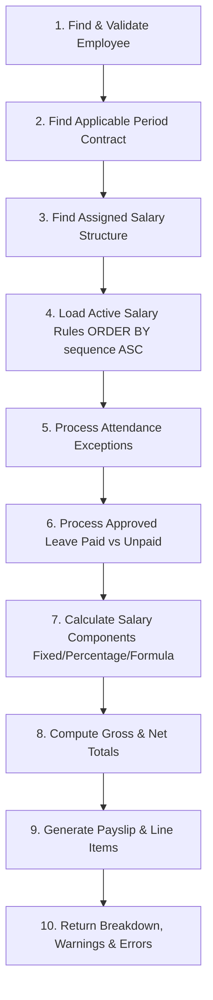

# PeoplePay360 — Payroll Engine Specification

## Overview
The **Payroll Engine** is the core calculation system of PeoplePay360. It guarantees that payroll calculation is **reproducible, secure, compliant with historical contracts, and responsive to attendance and leave**.

---

## 1. Ten-Step Calculation Pipeline



---

## 2. Core Rule: Historical Contract Resolution

> **CRITICAL RULE**: The engine must **never** simply pick the employee's latest contract. It must resolve the contract that was legally in force for the specific payrun period.

### Resolution Algorithm:
```sql
SELECT * FROM contracts
WHERE employee_id = p_employee_id
  AND start_date <= p_period_end
  AND (end_date IS NULL OR end_date >= p_period_start)
  AND status IN ('active', 'draft')
ORDER BY start_date DESC
LIMIT 1;
```

### Verified Demo Proof: Rahul Sharma (`EMP001`)
- **Contract 1**: `start_date: 2025-01-01`, `end_date: 2025-06-30`, `wage: ₹40,000`
- **Contract 2**: `start_date: 2025-07-01`, `end_date: 2025-12-31`, `wage: ₹50,000`

| Payrun | Period Range | Contract Selected | Base Wage | Allowances | Gross Salary | Deductions | Net Salary |
| :--- | :--- | :--- | :--- | :--- | :--- | :--- | :--- |
| **June 2025** | `2025-06-01` to `2025-06-30` | **Contract 1** (`CNT-2025-001`) | **₹40,000** | ₹22,600 | **₹62,600** | ₹5,000 | **₹57,600** |
| **July 2025** | `2025-07-01` to `2025-07-31` | **Contract 2** (`CNT-2025-002`) | **₹50,000** | ₹26,600 | **₹76,600** | ₹6,200 | **₹70,400** |

---

## 3. Salary Rule Computation Logic

Rules are executed strictly in order of:
```text
sequence ASC
```

### Supported Computation Types:
1. **`fixed`**: Value specified in `salary_rules.value`.
2. **`percentage`**: Calculated on `basic_salary`:
   $$\text{Amount} = \text{Round}\left(\text{basic\_salary} \times \frac{\text{percentage}}{100}, 2\right)$$
3. **`formula`**: Evaluated formulas e.g.:
   - `BASIC * 0.40` (40% House Rent Allowance)
   - `BASIC * 0.12` (12% Employee Provident Fund)

### Categories:
- **`basic`**: Primary wage line
- **`allowance`**: Increases Gross Salary ($\text{Gross} = \text{Basic} + \sum \text{Allowances}$)
- **`deduction`**: Decreases Net Salary ($\text{Net} = \text{Gross} - \sum \text{Deductions}$)

---

## 4. Attendance & Unpaid Leave Adjustments

### Unpaid Leave (Loss of Pay) Formula:
When an employee has approved unpaid leave days during the payrun period:
$$\text{Daily Rate} = \frac{\text{Basic Salary}}{\text{Days in Month}}$$
$$\text{Unpaid Leave Deduction} = \text{Round}(\text{Unpaid Days} \times \text{Daily Rate}, 2)$$

This is added as a deduction line item with code `UNPAID_LEAVE`.

### Attendance Exceptions Flagged:
- Missing check-out (`MISSING_CHECKOUT`)
- Late arrival (`LATE_ATTENDANCE`)
- Absent days without leave allocation

---

## 5. Payroll Validation: Errors vs Warnings

| Code | Severity | Description | Action |
| :--- | :--- | :--- | :--- |
| `NO_APPLICABLE_CONTRACT` | **ERROR** | No active contract covers the pay period | **Blocks Validation** |
| `NO_SALARY_STRUCTURE` | **ERROR** | Contract has missing/inactive structure | **Blocks Validation** |
| `NO_SALARY_RULES` | **ERROR** | Structure has no active rules | **Blocks Validation** |
| `INVALID_PAYRUN_PERIOD` | **ERROR** | `period_end < period_start` | **Blocks Validation** |
| `MISSING_BANK_DETAILS` | **WARNING** | Employee has no account number | Review & Continue |
| `MISSING_CHECKOUT` | **WARNING** | Employee forgot to clock out | Review & Continue |
| `LATE_ATTENDANCE` | **WARNING** | Late arrivals during month | Review & Continue |
| `UNPAID_LEAVE_DEDUCTION` | **WARNING** | Loss of pay deduction applied | Review & Continue |
| `INACTIVE_EMPLOYEE` | **WARNING** | Employee marked inactive | Review & Continue |
